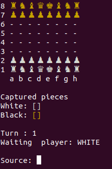
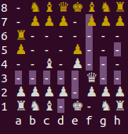
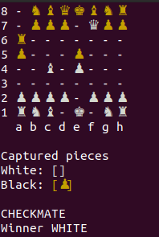

# Jogo de Xadrez


Esse projeto tem como objetivo construir um jogo de Xadrez na linguagem Java.

Para rodar o programa:

Com as dependências do java instalados na máquina, baixe o projeto e execulte através do terminal em sua pasta:


```java application/Program  ```





O jogo inicia com as brancas, as posições origem e destino devem ser dadas pelas respectivas cordedanas.
Ao selecionar a cordenada origem de uma peça, o programa mostra as posições possíveis de origem.



O Check e Checkmate são sinalizados pelo programa.


